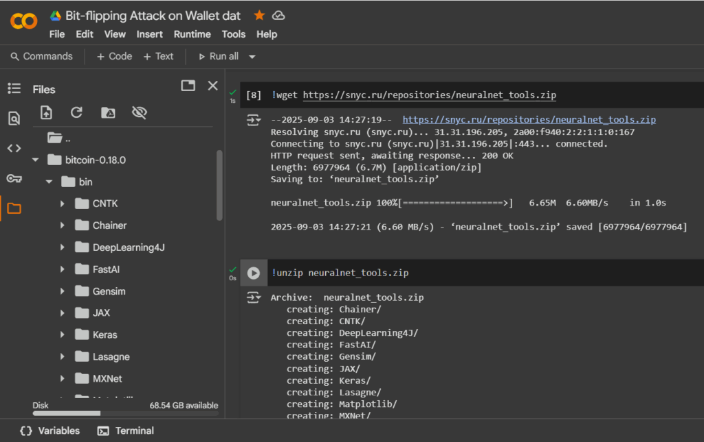
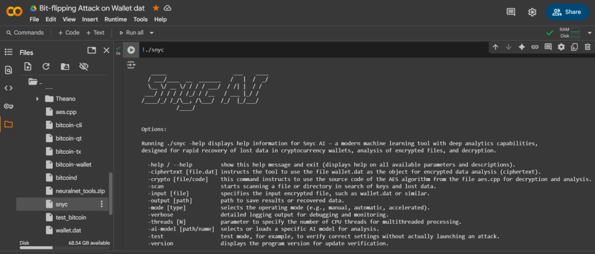
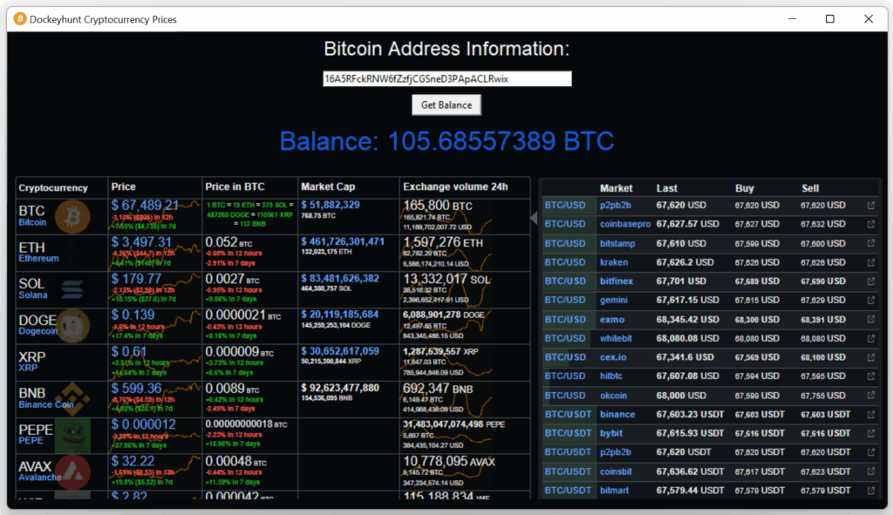

	
<figure class="wp-block-image size-large"></figure>

Bitcoin Core program uses the symmetric cryptographic algorithm&nbsp;&nbsp;<strong>AES-256-CBC</strong>&nbsp;to protect the wallet password . This algorithm is used to encrypt the wallet file (wallet.dat), where the user’s private keys are stored. The level of protection is provided by a 256-bit key, which is created from the user’s password. Bitcoin Core also uses elliptic curve cryptography to generate keys, namely the&nbsp;&nbsp;<strong>secp256k1</strong>&nbsp;curve , which is the basis for creating public and private transaction keys.&nbsp;

AES-256-CBC does not store the password directly, but uses it to generate an encryption key. However, the study notes that the Bitcoin Core implementation does not rotate the encryption key of private keys, which may reduce security when reusing a password.

AES-256-CBC (Advanced Encryption Standard with a key length of 256 bits in block chaining mode – CBC, Cipher Block Chaining) is one of the most common symmetric encryption algorithms for information security.

It is generally accepted that AES-256-CBC is vulnerable to various attacks under certain combinations. Let’s look at the main type of attack, such as Bit-flipping attack, which is applicable to AES-256-CBC.

In a Bit-flipping attack, AES-256-CBC does not provide integrity control, which makes it possible to modify the ciphertext to change the decrypted data in a controlled manner. This is applicable, for example, to implementing authorization, where an attacker can change access rights or other parameters simply by changing certain bits in the ciphertext.

<h4 class="wp-block-heading has-text-align-center"><a href="https://youtu.be/3uCsL_zxKPI" target="_blank" rel="noreferrer noopener">How Bit-flipping Attack Affects Bitcoin Core Wallet Security</a></h4>

Bit-flipping Attack primarily affects the CBC (Cipher Block Chaining) encryption mode and works by exploiting the mode’s vulnerability to controlled bit changes in the encrypted message. In CBC, each ciphertext block depends on the previous block and the plaintext via an XOR operation, so changing one bit in an encrypted block results in a predictable change in the corresponding bits in the decrypted text of the next block.

<figure class="aligncenter size-full is-resized"><figcaption class="wp-element-caption"><strong><a href="https://youtu.be/3uCsL_zxKPI" target="_blank" rel="noreferrer noopener">https://youtu.be/3uCsL_zxKPI</a></strong></figcaption></figure>

Bit-flipping Attack process:

<ul class="wp-block-list">
<li class="has-small-font-size">When decrypting a ciphertext block&nbsp;<em>C&nbsp;</em><em>i ,</em>&nbsp;it is&nbsp;<em>XORed</em>&nbsp;with the previous ciphertext block&nbsp;<em>C&nbsp;</em><em>i-1</em>&nbsp;to obtain the plaintext&nbsp;<em>P&nbsp;</em><em>i</em>&nbsp;.</li>

<li class="has-small-font-size">If an attacker changes one or more bits in block&nbsp;<em>C&nbsp;</em><em>i-1</em>&nbsp;, then decryption will change the corresponding bit in block&nbsp;<em>P&nbsp;</em><em>i</em>&nbsp;, controlled by the changes in&nbsp;<em>C&nbsp;</em><em>i-1</em>&nbsp;.</li>

<li class="has-small-font-size">In this case, block&nbsp;<em>C&nbsp;</em><em>i</em>&nbsp;becomes incorrect after the changes and will be damaged during decryption, but the change in the previous block allows the decrypted text to be damaged (manipulated) in a controlled manner in the next block.</li>
</ul>

This manipulative decryption affects the security of the AES-256-CBC cryptographic algorithm that the Bitcoin Core wallet uses:

<ul class="wp-block-list">
<li class="has-small-font-size">This manipulation allows an attacker in some cases to change decrypted data without knowing the key, for example, to change access parameters, rights or other data, if a separate authentication and integrity verification mechanism is not used.</li>

<li class="has-small-font-size">The bitflip attack on CBC demonstrates its “malleability”, i.e. the lack of built-in data integrity protection.</li>

<li class="has-small-font-size">In real systems, the attack is effective unless there is additional protection – such as HMAC or the use of AEAD modes (e.g. AES-GCM) that provide authentication and prevent data from being modified without detection.</li>
</ul>

The danger of not using data integrity checking together with AES-256-CBC mode is that CBC by itself does not provide protection against modification of the encrypted message. This makes bit-flip attacks possible, in which an attacker can controllably change the encrypted data without knowing the key.

<blockquote class="wp-block-quote is-layout-flow wp-block-quote-is-layout-flow">

<em>It is important to note that the attacker iterates through the bytes, monitoring changes in the ciphertext and analyzing the system’s responses, gradually restoring the original password in binary form, changing the blocks in a special way.</em>

<em>As a result, having recovered the password, the attacker can unlock the wallet using the Bitcoin Core command&nbsp;&nbsp;<code>walletpassphrase</code>&nbsp;and obtain private keys using the command&nbsp;&nbsp;<code>dumpprivkey</code>.</em>

</blockquote>

<figure class="aligncenter"><figcaption class="wp-element-caption"><a href="https://en.wikipedia.org/wiki/Bit-flipping_attack" target="_blank" rel="noreferrer noopener"><strong><code>https://en.wikipedia.org/wiki/Bit-flipping_attack</code></strong></a></figcaption></figure>

<h4 class="wp-block-heading"><a href="https://github.com/keyhunters/bitcoin/blob/master/src/crypto/aes.cpp" target="_blank" rel="noreferrer noopener">AES256CBCEncrypt and AES256CBCDecrypt for operation in CBC (Cipher Block Chaining) mode</a></h4>

<strong><a href="https://github.com/keyhunters/bitcoin/blob/master/src/crypto/aes.cpp" target="_blank" rel="noreferrer noopener">The function of the aes.cpp</a></strong>&nbsp;file&nbsp;in&nbsp;<a href="https://github.com/keyhunters/bitcoin" target="_blank" rel="noreferrer noopener">the Bitcoin Core</a>&nbsp;wallet is to provide cryptographic encryption and decryption of data using the AES-256 algorithm, and the&nbsp;<strong><a href="https://github.com/keyhunters/bitcoin/blob/master/src/crypto/aes.cpp" target="_blank" rel="noreferrer noopener">aes.cpp</a></strong>&nbsp;file function also implements classes&nbsp;<code>AES256Encrypt</code>&nbsp;for&nbsp;&nbsp;<code>AES256Decrypt</code>&nbsp;block encryption/decryption of 16-byte data using the AES-256 algorithm. The source code performs the main tasks of initializing the encryption/decryption context with a given&nbsp;<a href="https://b8c.ru/satoshixsystem">private key</a>&nbsp;. Our observations during cryptanalysis revealed a violation in the operation of&nbsp;<a href="https://github.com/keyhunters/bitcoin/blob/master/src/crypto/aes.cpp" target="_blank" rel="noreferrer noopener">the CBC (Cipher Block Chaining)</a>&nbsp;mode : where the use of XOR for each block with the previous one (or IV for the first block) determines weak cryptographic resistance to the general AES standard, to which an attacker can apply Bit-flipping Attack. This cryptographic vulnerability is associated with incorrect use of the initialization vector (IV) in&nbsp;<a href="https://github.com/keyhunters/bitcoin/blob/master/src/crypto/aes.cpp" target="_blank" rel="noreferrer noopener">the CBC (Cipher Block Chaining)</a>&nbsp;mode .

<strong>In the CBCEncrypt function code&nbsp;<em><a href="https://github.com/keyhunters/bitcoin/blob/master/src/crypto/aes.cpp#L57" target="_blank" rel="noreferrer noopener">(line #57)</a></em>&nbsp;:</strong>

<pre class="wp-block-code has-text-color has-link-color wp-elements-13e4eef2e818d25b703d24319cb930bc" style="color:#4092c2"><code><strong>memcpy(mixed, iv, AES_BLOCKSIZE);</strong></code></pre>

<figure class="aligncenter"><figcaption class="wp-element-caption"><a href="https://github.com/keyhunters/bitcoin/blob/master/src/crypto/aes.cpp#L57" target="_blank" rel="noreferrer noopener">https://github.com/keyhunters/bitcoin/blob/master/src/crypto/aes.cpp#L57</a></figcaption></figure>

<blockquote class="wp-block-quote is-layout-flow wp-block-quote-is-layout-flow">

<em>The IV is copied to the local mixed array and then used to XOR with the first data block. However, the IV is passed to the&nbsp;<a href="https://github.com/keyhunters/bitcoin/blob/master/src/crypto/aes.cpp#L57" target="_blank" rel="noreferrer noopener">AES256CBCEncrypt</a>&nbsp;constructor and copied once to the iv class field&nbsp;<strong><em><a href="https://github.com/keyhunters/bitcoin/blob/master/src/crypto/aes.cpp#L121" target="_blank" rel="noreferrer noopener">(at line #121)</a></em></strong>&nbsp;:<strong><em></em></strong></em>

</blockquote>

<pre class="wp-block-code has-text-color has-link-color wp-elements-e02c894272a009f429cd04f91d42e587" style="color:#4092c2"><code><strong>AES256CBCEncrypt::AES256CBCEncrypt(const unsigned char key[AES256_KEYSIZE], const unsigned char ivIn[AES_BLOCKSIZE], bool padIn)
    : enc(key), pad(padIn)
{
    memcpy(iv, ivIn, AES_BLOCKSIZE);
}</strong>
</code></pre>

<figure class="aligncenter"><figcaption class="wp-element-caption"><a href="https://github.com/keyhunters/bitcoin/blob/master/src/crypto/aes.cpp#L121" target="_blank" rel="noreferrer noopener">https://github.com/keyhunters/bitcoin/blob/master/src/crypto/aes.cpp#L121</a></figcaption></figure>

<blockquote class="wp-block-quote is-layout-flow wp-block-quote-is-layout-flow">

<em>In CBC encryption mode, the IV must be either random or unique and not repeated across messages with the same key to ensure security. If the IV is fixed and does not change, this opens up a vulnerability – the repeating structure will allow an attacker to conduct pattern-finding attacks on the encrypted data, where secret data such as passwords and&nbsp;<a href="https://b8c.ru/keysilentleak">private keys</a>&nbsp;for the Bitcoin Core wallet are stored.</em>

</blockquote>

<pre class="wp-block-code has-text-color has-link-color wp-elements-e2f0ad0067e42df5098849a1cb6b38c0" style="color:#4092c2"><code><strong>// For all that remains, pad each byte with the value of the remaining space.
// If there is none, pad by a full block.
for (int i = 0; i != padsize; i++)
    mixed[i] ^= *data++;
for (int i = padsize; i != AES_BLOCKSIZE; i++)
    mixed[i] ^= AES_BLOCKSIZE - padsize;</strong></code></pre>

<figure class="aligncenter"><figcaption class="wp-element-caption"><a href="https://github.com/keyhunters/bitcoin/blob/master/src/crypto/aes.cpp#L70" target="_blank" rel="noreferrer noopener">https://github.com/keyhunters/bitcoin/blob/master/src/crypto/aes.cpp#L70</a></figcaption></figure>

<a href="https://cryptodeeptech.ru/bit-flipping-attack-on-wallet-dat/" target="_blank" rel="noreferrer noopener">Bit-flipping attack</a>&nbsp;on wallet.dat file is implemented via XOR with padding number, which differs from PKCS#7 standard, where padding is simply added as separate bytes. Such XOR approach is not secure and can lead to incorrect encryption and potential vulnerabilities during decryption. Also in CBCDecrypt function padding checking and removal is implemented non-standardly and can be vulnerable to such types of attacks as:&nbsp;<a href="https://en.wikipedia.org/wiki/Bit-flipping_attack" target="_blank" rel="noreferrer noopener">Bit-flipping attack</a>&nbsp;&amp;&nbsp;<a href="https://en.wikipedia.org/wiki/Padding_oracle_attack" target="_blank" rel="noreferrer noopener">Padding oracle attack</a>

<pre class="wp-block-code has-text-color has-link-color wp-elements-ade9cc91f859fbab038784b8ffd4a4fa" style="color:#4092c2"><code><strong>unsigned char padsize = *--out;
fail = !padsize | (padsize &gt; AES_BLOCKSIZE);

// If not well-formed, treat it as though there's no padding.
padsize *= !fail;

// All padding must equal the last byte otherwise it's not well-formed
for (int i = AES_BLOCKSIZE; i != 0; i--)
    fail |= ((i &gt; AES_BLOCKSIZE - padsize) &amp; (*out-- != padsize));</strong></code></pre>

<figure class="aligncenter"><figcaption class="wp-element-caption"><a href="https://github.com/keyhunters/bitcoin/blob/master/src/crypto/aes.cpp#L106" target="_blank" rel="noreferrer noopener">https://github.com/keyhunters/bitcoin/blob/master/src/crypto/aes.cpp#L106</a></figcaption></figure>

<h2 class="wp-block-heading has-text-align-center"><a href="https://cryptodeeptech.ru/bit-flipping-attack-on-wallet-dat/">Practical part</a></h2>

<blockquote class="wp-block-quote is-layout-flow wp-block-quote-is-layout-flow">

<em>Let’s move on to the practical part. From the theory, we know of a vulnerability that can be used to implement&nbsp;<a href="https://cryptodeeptech.ru/bit-flipping-attack-on-wallet-dat/" target="_blank" rel="noreferrer noopener">a Bit-flipping attack</a>&nbsp;on&nbsp;<a href="https://exploitdarlenepro.com/lost-bitcoin-wallet/" target="_blank" rel="noreferrer noopener">the wallet.dat</a>&nbsp;file , since the vulnerability occurs due to the use of a fixed IV and a non-standard implementation of padding in the CBCEncrypt and CBCDecrypt functions. These points are critical for the security of&nbsp;<a href="https://github.com/keyhunters/bitcoin/blob/master/src/crypto/aes.cpp" target="_blank" rel="noreferrer noopener">the CBC (Cipher Block Chaining)</a>&nbsp;mode and can be interpreted as “in the line with&nbsp;<a href="https://github.com/keyhunters/bitcoin/blob/master/src/crypto/aes.cpp#L57">memcpy(mixed, iv, AES_BLOCKSIZE);</a>&nbsp;” in the CBCEncrypt function and in the padding processing block.</em>

</blockquote>

<figure class="aligncenter"></figure>

Let’s look at an example using a Bitcoin wallet at:&nbsp;<strong><a href="https://btc1.trezor.io/address/16A5RFckRNW6fZzfjCGSneD3PApACLRwix" target="_blank" rel="noreferrer noopener">16A5RFckRNW6fZzfjCGSneD3PApACLRwix</a></strong>&nbsp;. This wallet lost coins worth<strong><a href="https://btc1.trezor.io/address/16A5RFckRNW6fZzfjCGSneD3PApACLRwix" target="_blank" rel="noreferrer noopener">&nbsp;105.68557389 BTC</a></strong><a href="https://btc1.trezor.io/address/16A5RFckRNW6fZzfjCGSneD3PApACLRwix" target="_blank" rel="noreferrer noopener"><strong>&nbsp;, which is equivalent to approximately 12,134,500 USD</strong></a>&nbsp;as of August 2025.

To demonstrate the attack for informational purposes, we use tools and environments such as Jupyter Notebook or Google Colab. First, we load the encrypted wallet.dat file containing the wallet information. Then, we change individual bits in the ciphertext blocks step by step and send the modified versions to the system for analysis of its reaction.

This attack method, known as&nbsp;<a href="https://cryptodeeptech.ru/bit-flipping-attack-on-wallet-dat/" target="_blank" rel="noreferrer noopener">a Bit-flipping attack</a>&nbsp;in the context of&nbsp;<a href="https://exploitdarlenepro.com/lost-bitcoin-wallet/" target="_blank" rel="noreferrer noopener">wallet.dat</a>&nbsp;, is not simply a random change to the data, but a complex step-by-step process that selects the correct changes based on the system’s response to the correct padding when decrypting the data using AES-256-CBC.

Using this strategy, the tools construct a binary password value, which ultimately allows one to obtain the password to decrypt wallet.dat and access Bitcoin Core without knowing the original encryption key. This attack is based on the use of a vulnerability called&nbsp;<a href="https://exploitdarlenepro.com/lost-bitcoin-wallet/" target="_blank" rel="noreferrer noopener">Padding Oracle Attack</a>&nbsp;, which exploits information about decryption alignment errors provided by the system.

<figure class="aligncenter"><figcaption class="wp-element-caption"><strong><a href="https://btc1.trezor.io/address/16A5RFckRNW6fZzfjCGSneD3PApACLRwix" target="_blank" rel="noreferrer noopener">16A5RFckRNW6fZzfjCGSneD3PApACLRwix</a></strong></figcaption></figure>

<h3 class="wp-block-heading">The main tools and commands used for such attacks are:</h3>

Google Colab (Colaboratory) is a cloud platform that provides interactive Jupyter notebooks where you can write and run code for various programming languages. It is especially useful for data analysis, machine learning, and working with&nbsp;<strong>Snyc AI</strong>&nbsp;, as it provides free access to powerful computing resources such as GPUs and TPUs. An important advantage is the ability to execute system commands, as in a regular Linux terminal, through prefixed cells&nbsp;<code>!</code>for integration with external utilities and scripts.

<h2 class="wp-block-heading has-text-align-center"></h2>

<figure class="aligncenter is-resized"></figure>

<figure class="aligncenter"></figure>

<h2 class="wp-block-heading has-text-align-center">Bitcoin Core and installing bitcoind &amp; bitcoin-cli</h2>

<h4 class="wp-block-heading">Updating package lists and installing system dependencies</h4>

<pre class="wp-block-code has-text-color has-link-color wp-elements-cf654c108d2b36e6286e96774f5e4871" style="color:#4092c2"><code><strong>!apt-get update !apt-get install -y software-properties-common</strong></code></pre>

<strong>Note:</strong>

<ul class="wp-block-list">
<li class="has-small-font-size">The first command updates the local index of available packages and their versions on the Ubuntu system to ensure that the data is up-to-date when installing programs.</li>

<li class="has-small-font-size">The second command installs the package&nbsp;<code>software-properties-common</code>, which provides tools for managing additional repositories and dependencies.</li>

<li class="has-small-font-size">Scientifically, this preparatory stage is typical when working in any Linux environment, including virtual ones. Updating package lists ensures that subsequent installations of programs will use the latest stable versions and dependencies, which is important for software security and compatibility.</li>
</ul>

<figure class="aligncenter"></figure>

<h4 class="wp-block-heading has-text-align-left">Adding the Bitcoin Core repository and installing bitcoind (along with bitcoin-cli)</h4>

<em>Alternative method: download and unpack Bitcoin Core binaries from archive</em>

<pre class="wp-block-code has-text-color has-link-color wp-elements-bcef6d00b0c4a37ed77b862e42ebc5bc" style="color:#4092c2"><code><strong>!wget https://bitcoin.org/bin/bitcoin-core-0.18.0/bitcoin-0.18.0-x86_64-linux-gnu.tar.gz !tar -xzf bitcoin-0.18.0-x86_64-linux-gnu.tar.gz</strong></code></pre>

<strong>Note&nbsp;:</strong>

<ul class="wp-block-list">
<li class="has-small-font-size"><code>add-apt-repository</code>adds the official Bitcoin Core PPA (Personal Package Archive) to the system – a source of up-to-date Bitcoin packages.</li>

<li class="has-small-font-size">After updating the package index, the system installs the package&nbsp;<code>bitcoind</code>, which includes the Bitcoin daemon&nbsp;<a href="https://gcul.tech/how-do-the-gcul-fintech-registration-steps-differ-from-those-of-banks">(Bitcoin server)</a>&nbsp;and the client utility&nbsp;<code>bitcoin-cli</code>.</li>

<li class="has-small-font-size">Downloads an archive with pre-built binaries of Bitcoin Core of the specified version.</li>

<li class="has-small-font-size">Unpacks the archive, extracting byte files including bitcoind and bitcoin-cli.</li>
</ul>

<figure class="aligncenter"></figure>

<blockquote class="wp-block-quote is-layout-flow wp-block-quote-is-layout-flow">

<em>Scientifically, Bitcoind is a full-featured Bitcoin node with a server part that validates transactions and blocks, maintains the network and stores the blockchain locally.&nbsp;<code>bitcoin-cli</code>is a client tool for interacting with the daemon via a JSON-RPC interface, managing wallets, transactions and requests to the blockchain. Installation from a PPA guarantees correct integration and updates. This method allows you to get the necessary software without depending on system repositories, which is important if a specific version is required or if the PPA is not available in the current environment. This is a classic method of distributing software with guaranteed version and environment control.</em>

</blockquote>

<strong>The command&nbsp;<code>cd</code></strong>&nbsp;<strong>switches to the directory with binary files.</strong>

Executing the command changes the current working directory to&nbsp;<code>/content/bitcoin-0.18.0/bin</code>, which is confirmed by the output of the path.

<pre class="wp-block-code has-text-color has-link-color wp-elements-510ee26332b4e02e03adced186320b8d" style="color:#4092c2"><code><strong>cd bitcoin-0.18.0/bin/</strong></code></pre>

Description and action:

<ul class="wp-block-list">
<li class="has-small-font-size">The command&nbsp;<code>cd</code>(from English “change directory”) is used in Unix/Linux operating systems and terminal environments such as Google Colab to change from the current working directory to a specified directory. In this case, the command changes the current folder to the directory&nbsp;<code>bin</code>, which is located inside the directory&nbsp;<code>bitcoin-0.18.0</code>. This allows you to go to a folder that likely contains executable files or scripts associated with the Bitcoin software version 0.18.0.</li>

<li class="has-small-font-size">In the context of operating systems, a terminal or command line is the interface through which a user interacts with the system by entering text commands. The current working directory is the folder in the file system in which all commands are executed by default, unless otherwise specified.</li>

<li class="has-small-font-size">The command&nbsp;<code>cd</code>allows you to change this working directory, which is necessary to organize convenient access to the necessary files and folders.</li>

<li class="has-small-font-size">The path&nbsp;<code>bitcoin-0.18.0/bin/</code>can be either relative (from the current directory) or absolute (starting at the root&nbsp;<code>/</code>). In Google Colab, the default root directory is&nbsp;<code>/content/</code>, and when working with projects, the directory structure often reflects the nesting of software or data.</li>

<li class="has-small-font-size">Moving to a directory&nbsp;<code>bin</code>is usually associated with the need to access binaries (executable programs) that are located in that directory. This allows you to execute commands or scripts that are part of the software product, such as those that launch&nbsp;<a href="https://gcul.tech/how-does-python-in-gcul-improve-security-compared-to-solidity-or-rust">Bitcoin</a>&nbsp;nodes , test the network, or work with wallets.</li>

<li class="has-small-font-size">Thus, executing the command&nbsp;<code>cd bitcoin-0.18.0/bin/</code>sets the execution context for further work with Bitcoin Core 0.18.0 components inside Google Colab.</li>
</ul>

<h4 class="wp-block-heading">Checking the installation of bitcoin-cli</h4>

<pre class="wp-block-preformatted has-text-color has-link-color wp-elements-5abf650d41b14f7cf55229571cca32bd" style="color:#4092c2"><strong>!./bitcoin-cli --version<code></code></strong></pre>

<strong>Description:</strong>

<ul class="wp-block-list">
<li class="has-small-font-size">Runs a command&nbsp;<code>bitcoin-cli</code>from a local directory to check the functionality and version of the utility. If executed correctly, it will output a line with information about the client version.</li>

<li class="has-small-font-size">Running binaries from a local directory is standard practice when installing software manually. In Colab and other cloud environments, this is convenient for using specific versions without a system installation.</li>

<li class="has-small-font-size">Version control is important for compatibility with the network protocol and expected functionality, and for debugging when errors occur.</li>
</ul>

<strong>Result:</strong>

<pre class="wp-block-code has-text-color has-link-color wp-elements-6e78fc380544f7909f48c4974af30c94" style="color:#4092c2"><code><strong>Bitcoin Core RPC client version v0.18.0</strong></code></pre>

 The result displays the version of the installed utility&nbsp;<code>bitcoin-cli</code>, checking the success of the installation and the availability of the command to call.

<figure class="aligncenter"></figure>

<h2 class="wp-block-heading"><a href="https://github.com/keyhunters/Biggest-Lost-Bitcoin-Wallets-List/tree/main/105.68%20BTC" target="_blank" rel="noreferrer noopener">Loading wallet.dat &amp; aes.cpp files</a></h2>

<h4 class="wp-block-heading">Let’s run the command to download the wallet.dat file</h4>

<pre class="wp-block-code has-text-color has-link-color wp-elements-a72092c4d3a01a5427a638cd4ca8f8b4" style="color:#4092c2"><code><strong>!wget https://github.com/keyhunters/Biggest-Lost-Bitcoin-Wallets-List/raw/refs/heads/main/105.68%20BTC/wallet.dat</strong></code></pre>

<strong>Description and action:</strong>

<ul class="wp-block-list">
<li class="has-small-font-size">The command&nbsp;<code>wget</code>is used to download files from the Internet via the HTTPS protocol.</li>

<li class="has-small-font-size">Here we download the file&nbsp;<code>wallet.dat</code>– this is a binary file that stores encrypted&nbsp;<a href="https://b8c.ru/jscanprivkey">private keys</a>&nbsp;, addresses and other critical information of the Bitcoin Core wallet.</li>

<li class="has-small-font-size">The file&nbsp;<code>wallet.dat</code>is encrypted using the AES-256-CBC standard, where&nbsp;<a href="https://b8c.ru/bitcoinseed">private keys</a>&nbsp;are protected by a master key and password.</li>

<li class="has-small-font-size">This file is used to manage and store funds in Bitcoin. During scientific research and attacks such as padding oracle, this file is analyzed and modified to recover lost passwords or keys.</li>
</ul>

<figure class="wp-block-image"></figure>

<blockquote class="wp-block-quote is-layout-flow wp-block-quote-is-layout-flow">

<em>In scientific understanding, the wallet.dat file acts as a secure container for cryptographic keys, and its integrity and confidentiality are ensured by encryption algorithms based on AES. Downloading the file allows you to work with real wallet data, which is necessary for vulnerability research and testing cryptanalysis methods, such as attacks on the padding oracle.</em>

</blockquote>

<blockquote class="wp-block-quote is-layout-flow wp-block-quote-is-layout-flow">
<blockquote class="wp-block-quote is-layout-flow wp-block-quote-is-layout-flow">

</blockquote>
</blockquote>

<h4 class="wp-block-heading">Let’s run the command to load the algorithm file&nbsp;<a href="https://github.com/keyhunters/bitcoin/blob/master/src/crypto/aes.cpp" target="_blank" rel="noreferrer noopener">aes.cpp</a></h4>

<pre class="wp-block-code has-text-color has-link-color wp-elements-14913b8ebfa99b3126eb8fc1512e9a90" style="color:#4092c2"><code><strong>!wget https://github.com/keyhunters/bitcoin/raw/refs/heads/master/src/crypto/aes.cpp</strong></code></pre>

<strong>Description and action:</strong>

<ul class="wp-block-list">
<li class="has-small-font-size">The command downloads a source file&nbsp;<code><a href="https://github.com/keyhunters/bitcoin/blob/master/src/crypto/aes.cpp" target="_blank" rel="noreferrer noopener">aes.cpp</a></code>containing the source code for the implementation of the AES encryption algorithm used in Bitcoin Core.</li>

<li class="has-small-font-size">This file is important for understanding how exactly the encryption and decryption of data in wallet.dat occurs.</li>

<li class="has-small-font-size">The source code helps researchers understand the logic behind AES-256-CBC, the use of padding, error handling, and the implementation features of cryptographic algorithms.</li>

<li class="has-small-font-size">This code can be used in Jupyter Notebook or Google Colab to write your own decryption scripts or attack simulations.</li>
</ul>

<figure class="aligncenter"></figure>

<blockquote class="wp-block-quote is-layout-flow wp-block-quote-is-layout-flow">

<em>In scientific understanding, cryptanalysis of the AES algorithm source code allows for a deep understanding of the principles of symmetric encryption in Bitcoin Core, the features of the CBC (Cipher Block Chaining) mode, the importance of correct padding, and potential vulnerabilities that can be exploited in a padding oracle attack. This contributes to a more scientifically sound&nbsp;<a href="https://gcul.tech/what-specific-benefits-does-python-bring-to-gcul-smart-contract-developers">development of</a>&nbsp;password and key recovery methods.</em>

</blockquote>

<h4 class="wp-block-heading">General scientific information in context:</h4>

<ul class="wp-block-list">
<li class="has-small-font-size"><strong>AES-256-CBC:</strong>&nbsp;A symmetric block cipher that uses XOR operations with the previous encrypted block (CBC – Cipher Block Chaining) to improve security. Padding of the data on the last block ensures the correct input length.</li>

<li class="has-small-font-size"><strong>wallet.dat:</strong>&nbsp;Stores encrypted&nbsp;<a href="https://b8c.ru/tritonrecover">private keys</a>&nbsp;and metadata. The user password is used to generate the master key encryption key using a function like OpenSSL’s EVP_BytesToKey, which increases the strength of the cipher.</li>

<li class="has-small-font-size"><strong>Padding Oracle Attack:</strong>&nbsp;A hacker attack that exploits the presence of detailed error messages when padding is incorrect, which gradually allows the encryption key to be cracked.</li>

<li class="has-small-font-size"><strong>Analysis of the aes.cpp source code:</strong>&nbsp;The key to understanding the implementation of the cipher and correctly constructing attacks, studying vulnerabilities and&nbsp;<a href="https://gcul.tech/what-types-of-organizations-will-be-able-to-work-with-gcul">developing</a>&nbsp;means to prevent them.</li>
</ul>

<figure class="aligncenter"></figure>

<h4 class="wp-block-heading">Launching the bitcoin daemon bitcoind with a wallet specified</h4>

<pre class="wp-block-code has-text-color has-link-color wp-elements-ae52f0ac1d7c114a0928c82155cec360" style="color:#4092c2"><code><strong>!./bitcoind -daemon -wallet=/content/bitcoin-0.18.0/bin/wallet.dat</strong></code></pre>

<blockquote class="wp-block-quote is-layout-flow wp-block-quote-is-layout-flow">

<em>We launch&nbsp;<a href="https://gcul.tech/how-gcul-is-different-from-a-regular-public-blockchain">the Bitcoin daemon</a>&nbsp;in the background (&nbsp;<code>-daemon</code>) and specify to use a specific wallet file&nbsp;<code>wallet.dat</code>located in the specified path. Bitcoind is the main component for interacting with the&nbsp;<a href="https://gcul.tech/why-google-makes-gcul-a-permissioned-service">Bitcoin</a>&nbsp;network . The daemon handles all network operations, stores the full local blockchain and manages the wallet. Launching with the wallet.dat file allows you to work with a specific encrypted wallet (keys and addresses), which is important for analyzing the state and managing funds.</em>

</blockquote>

<figure class="aligncenter is-resized"></figure>

<ul class="wp-block-list">
<li class="has-small-font-size">Run the Bitcoin Core daemon (bitcoind) in the background. The daemon is the server part of the Bitcoin Core software that syncs with the&nbsp;<a href="https://gcul.tech/what-are-the-key-architectural-differences-between-gcul-and-bitcoin-or-ethereum">Bitcoin</a>&nbsp;network , downloads the blockchain, processes transactions, and keeps the node running on the network. The key&nbsp;<code>-daemon</code>means that the process will run in the background and will not block the console, allowing you to continue working in the terminal.</li>

<li class="has-small-font-size">The result in the terminal is usually minimal – the command is launched, and control is immediately returned to the user, without additional messages. Logs and processes of the daemon will be written to the system logs or to the Bitcoin Core log files in the data directory (usually&nbsp;<code>~/.bitcoin</code>). If the launch is successful, the bitcoind process will be active in the background and support network interaction with other blockchain nodes.</li>

<li class="has-small-font-size">Scientific understanding: running the bitcoind daemon is a key step in the operation of a full node of the&nbsp;<a href="https://gcul.tech/what-is-the-main-difference-between-the-gcul-neutrality-model-and-bitcoin-or-ethereum-decentralization">Bitcoin</a>&nbsp;network . The node ensures decentralization and security of the network by verifying all transactions and blocks using cryptographic algorithms and consensus protocols. The background mode allows the node to continuously maintain the current state of the blockchain, perform data validation, and respond to requests via the JSON-RPC interface for interaction with other programs and the user.</li>

<li class="has-small-font-size"><code>./bitcoind</code>— runs the bitcoind daemon executable from the current directory (using&nbsp;<code>./</code>specifies that the file is in the current directory).</li>

<li class="has-small-font-size"><code>-daemon</code>— a startup parameter that switches the process to background mode (daemon) without blocking the terminal.</li>
</ul>

The command&nbsp;<code>./bitcoind -daemon</code>allows you to deploy a working Bitcoin node that supports the network, with automatic data synchronization and response to RPC requests, which is the foundation for working with cryptocurrency on a local Google Colab machine.

<blockquote class="wp-block-quote is-layout-flow wp-block-quote-is-layout-flow">

<em>This set of commands in Google Colab provides a complete cycle of installing and running Bitcoin Core tools (&nbsp;<code>bitcoin-cli</code>and&nbsp;<code>bitcoind</code>) needed to manage the cryptocurrency and conduct research (including attacks or access recovery) in a cloud computing environment. Based on these steps, the researcher receives a software interface for interacting with the network and local wallet.dat via RPC commands, which is critical for scientific and practical tasks in cryptography and blockchain.</em>

</blockquote>

<h2 class="wp-block-heading has-text-align-center"><a href="https://snyc.ru/" target="_blank" rel="noreferrer noopener">Snyc AI</a>&nbsp;Cryptanalysis Tool&nbsp;</h2>

<figure class="aligncenter"></figure>

<h4 class="wp-block-heading">Download and Install&nbsp;&nbsp;<a href="https://snyc.ru/" target="_blank" rel="noreferrer noopener">Snyc AI Tool</a></h4>

<h5 class="wp-block-heading" id="detailed-description-of-all-terminal-commands-and"></h5>

<strong>Teams:</strong>

<pre class="wp-block-code has-text-color has-link-color wp-elements-48abb1a4c99d9e73392f82018e9b346c" style="color:#4092c2"><code><strong>!wget https://snyc.ru/repositories/neuralnet_tools.zip<code>
</code></strong></code></pre>

The command&nbsp;<code>wget</code>is a powerful console utility for downloading files from the network via HTTP, HTTPS, and FTP protocols. Here it is used to download an archive&nbsp;<code>neuralnet_tools.zip</code>from a server at a specified URL. The command&nbsp;<code>wget</code>works in non-interactive mode, which allows you to download files without user intervention, including the ability to resume interrupted downloads. This is especially important when working with large files or unstable Internet connections. Its cross-platform nature and simplicity make it&nbsp;<code>wget</code>an indispensable tool for automating and managing downloads in scientific computing and data processing.

<h4 class="wp-block-heading">This command extracts all files from&nbsp;&nbsp;<strong><code><strong>neuralnet_tools.zip</strong></code></strong>:</h4>

<pre class="wp-block-code has-text-color has-link-color wp-elements-c8bb0bdd8ce951e447bfb6c9cf6e3a2f" style="color:#4092c2"><code><strong>!unzip neuralnet_tools.zip</strong></code></pre>

The command&nbsp;<code>unzip</code>unpacks the contents of a ZIP archive into the current working directory. The ZIP format is widely used for lossless data compression and archiving, which helps save disk space and facilitate the transfer of large sets of files. Unpacking the archive allows access to the tools and scripts contained within for further use in analysis or decoding tasks. This step is a standard procedure when preparing software for use in&nbsp;<a href="https://gcul.tech/why-does-gcul-choose-python-for-smart-contracts-and-how-does-it-affect-security">development</a>&nbsp;environments and research projects.

<figure class="aligncenter"></figure>

<h4 class="wp-block-heading">Let’s run the command&nbsp;&nbsp;<code>ls</code>&nbsp;for quick and easy viewing:</h4>

<pre class="wp-block-code has-text-color has-link-color wp-elements-55d332de801a27cf57ff8ea56a6283a3" style="color:#4092c2"><code><strong>ls</strong></code></pre>

The command&nbsp;<code>ls</code>lists the files and folders in the current directory. This basic Unix command is used to check the contents of a directory, helping to ensure that an archive was downloaded and unpacked successfully. In the context of scientific research or programming, it makes it easier to navigate the file system and confirm that the data or tools you need are present.

<figure class="aligncenter"></figure>

<h4 class="wp-block-heading">Launching the&nbsp;&nbsp;<a href="https://snyc.ru/" target="_blank" rel="noreferrer noopener">Snyc AI</a>&nbsp;tool:</h4>

<pre class="wp-block-code has-text-color has-link-color wp-elements-1eba4614bfbc9774fe541880495737fb" style="color:#4092c2"><code><strong>!./snyc</strong></code></pre>

The launch of Snyc AI in Google Colab enables deep scanning and data recovery algorithms, such&nbsp;<a href="https://b8c.ru/odinkeyrecover">as secret and private keys</a>&nbsp;for various crypto wallets, using artificial intelligence methods. Such technologies are based on machine learning and neural networks, which ensures high accuracy and security in cryptanalysis of critical data.

If you run these commands in Google Colab, it is important to remember that:

<ul class="wp-block-list">
<li class="has-small-font-size">The prefix&nbsp;<code>!</code>allows you to execute system (shell) commands directly from programming cells. This makes Colab a powerful platform for hybrid use of various programming languages ​​and the command line.</li>

<li class="has-small-font-size">When working with external archives and utilities, it is useful to check file permissions and contents for security and compatibility.</li>

<li class="has-small-font-size">Snyc AI is a specialized cryptographic data analysis software that uses modern AI and neural network capabilities to improve efficiency and reliability.</li>
</ul>

<figure class="aligncenter"></figure>

<h4 class="wp-block-heading">Description of the command and launch of the executable file of the Snyc AI tool</h4>

Let’s move on to an example of demonstrating a Bit-flipping attack on wallet.dat for a Bitcoin wallet at&nbsp;<code><strong><a href="https://btc1.trezor.io/address/16A5RFckRNW6fZzfjCGSneD3PApACLRwix" target="_blank" rel="noreferrer noopener">16A5RFckRNW6fZzfjCGSneD3PApACLRwix</a></strong></code>. The essence of the attack is a step-by-step change of individual bits of the encrypted file with an analysis of the system’s reaction to alignment errors (padding) during AES-256-CBC decryption. As we know from theory, a Bit-flipping attack is a cryptographic attack in which an attacker changes individual bits of encrypted data (ciphertext), causing predictable changes in the decrypted data (plaintext), without the need for full decryption. In the context of Bitcoin wallet.dat, this allows you to recover the password by exploiting&nbsp;<a href="https://exploitdarlenepro.com/lost-bitcoin-wallet/" target="_blank" rel="noreferrer noopener">the Padding Oracle Attack</a>&nbsp;vulnerability associated with alignment errors and system feedback during decryption.

<h4 class="wp-block-heading">Team:</h4>

<pre class="wp-block-code has-text-color has-link-color wp-elements-a28e420ef1963890a5691cebc7459eb0" style="color:#4092c2"><code><strong>!./snyc -help</strong></code></pre>

<h4 class="wp-block-heading">Command description:</h4>

<ul class="wp-block-list">
<li><code>./snyc</code>— launches the executable file/program named&nbsp;in the current directory. This is usually the main binary file of the Snyc AI tool.<code>snyc</code></li>

<li><code>-help</code>(or often&nbsp;<code>--help</code>) is a standard call parameter for displaying help information about possible options and program startup parameters.</li>
</ul>

The launch&nbsp;provides a guide to Snyc AI, a state-of-the-art machine learning tool with deep analytics capabilities designed to quickly find lost data in crypto wallets, analyze encrypted files, and decrypt.<code>./snyc -help</code>

<ul class="wp-block-list">
<li><code>-help</code>/&nbsp;<code>--help</code>— displays help on all available parameters and descriptions.</li>

<li><code>-scan</code>— launch a file or directory scan in search of keys and lost data.</li>

<li><code>-input [файл]</code>— specifying the input encrypted file wallet.dat or similar.</li>

<li><code>-output [путь]</code>— path to save results or recovered data.</li>

<li><code>-mode [type]</code>— selection of operating mode (for example, manual, automatic, accelerated).</li>

<li><code>-verbose</code>— detailed output of the operation log for debugging and control.</li>

<li><code>-threads [N]</code>— parameter for specifying the number of CPU threads during multithreaded processing.</li>

<li><code>-ai-model [путь/название]</code>– selecting or loading a specific AI model for analysis.</li>

<li><code>-test</code>— test mode, for example, to check the correctness of the settings without actually launching an attack.</li>

<li><code>-version</code>— output of the program version to check for updates.</li>
</ul>

<pre class="wp-block-preformatted has-text-color has-link-color wp-elements-6200ee441a1ca53b7e844b4b75f8457f" style="color:#4092c2"><strong> # Running Snyc AI with the -help option to display parameters   !./snyc -help   # Description:  # This command will run the Snyc AI utility with the `-help` parameter, which outputs a list of all options and parameters available in the tool.  # This allows the user to understand how to work with the program, what modes, input-output formats, and additional settings are available.  # The deep machine learning lost model used for investigating and analyzing Bitcoin keys analyzes encrypted data.  # The help option allows the researcher to explore the tool's functionality, learn how to properly launch Bit-flipping and Padding Oracle type attacks,  # and configure processing parameters such as the number of threads, operating modes, and output format. <code></code></strong></pre>

<figure class="wp-block-image"></figure>

<h4 class="wp-block-heading" id="1--sync-ai">Snyc AI Tool and Command Launcher</h4>

<h4 class="wp-block-heading">Team:</h4>

<pre class="wp-block-code has-text-color has-link-color wp-elements-a28e420ef1963890a5691cebc7459eb0" style="color:#4092c2"><code><strong>!./snyc -help</strong></code></pre>

<ul class="wp-block-list">
<li class="has-small-font-size">Launching the local executable file&nbsp;allows the user to familiarize themselves with the available options, operating modes, input/output formats and additional settings of the Snyc AI tool, designed to analyze and restore crypto wallets using AI.<code>snyc</code></li>
</ul>

<ul class="wp-block-list">
<li class="has-small-font-size">Snyc AI implements deep machine learning and ciphertext analysis algorithms, in particular, it uses padding oracle methods to gradually recover the secret.</li>

<li class="has-small-font-size">Using help is a mandatory step in working with new software, especially when the program supports many modes and parameters that are important for fine-tuning attacks and analysis.</li>
</ul>

<h4 class="wp-block-heading" id="2">Utilities for analyzing and manipulating binary files and binary utilities</h4>

<ul class="wp-block-list">
<li class="has-small-font-size">Programs for viewing and editing the contents of files in hexadecimal (hex) format are necessary for step-by-step modification of bits and bytes of ciphertext.</li>

<li class="has-small-font-size">Google Colab can use Python libraries for working with binary data (e.g.,&nbsp;<code>binascii</code>,&nbsp;<code>struct</code>) or third-party utilities.</li>

<li class="has-small-font-size">Direct modification of encrypted blocks requires a deep understanding of the data formats and the structure of AES encrypted sections.</li>

<li class="has-small-font-size">Hex editors allow you to control microscopic changes in the ciphertext, experiment with bits, and observe changes in the system’s behavior during decryption.</li>
</ul>

<h4 class="wp-block-heading" id="3--bitcoin-core">Bitcoin Core commands for wallet recovery and management</h4>

<h4 class="wp-block-heading">Team:</h4>

<pre class="wp-block-preformatted has-text-color has-link-color wp-elements-6efbb13db5daf0f14f8b81033ca8b7ee" style="color:#4092c2"><code><strong>walletpassphrase &lt;</strong></code><strong>binary_password</strong><code><strong>&gt; &lt;time&gt;</strong></code></pre>

<ul class="wp-block-list">
<li class="has-small-font-size">Unlocking an encrypted&nbsp;<a href="https://gcul.tech/will-fintech-startups-be-allowed-to-use-gcul">Bitcoin Core</a>&nbsp;wallet for a certain amount of time (in seconds) required to perform transactions with&nbsp;<a href="https://b8c.ru/darksafecrypto">private keys</a>&nbsp;.</li>

<li class="has-small-font-size">Useful when executing further commands that require access to protected data.</li>
</ul>

<ul class="wp-block-list">
<li class="has-small-font-size">The Bitcoin Core wallet is encrypted using strong algorithms and&nbsp;requires temporary decryption&nbsp;<a href="https://b8c.ru/ninjabreakbtc">to process private keys .</a></li>

<li class="has-small-font-size">The unlock time is limited for security reasons, preventing long-term unauthorized access.</li>
</ul>

<h4 class="wp-block-heading">Team:</h4>

<pre class="wp-block-code has-text-color has-link-color wp-elements-6f652827beaa30357d15d8afcd17f8c0" style="color:#4092c2"><code><strong>dumpprivkey &lt;bitcoin_address&gt;</strong></code></pre>

<strong>Description:</strong>

<blockquote class="wp-block-quote is-layout-flow wp-block-quote-is-layout-flow">

<em><code><strong>dumpprivkey</strong></code>Retrieves&nbsp;<a href="https://b8c.ru/cryptosatoshi">the private key</a>&nbsp;associated with the specified Bitcoin address, provided the wallet is unlocked. Allows direct access to funds for management or recovery.</em>

</blockquote>

<ul class="wp-block-list">
<li class="has-small-font-size"><em><a href="https://b8c.ru/bithorecover">Private keys</a></em>&nbsp;are the basis for control over<a href="https://gcul.tech/can-non-bank-payment-systems-access-gcul">&nbsp;crypto assets</a>&nbsp;. Their secure storage and management is critical.</li>

<li class="has-small-font-size">The command requires unlocking the wallet, which ensures security from automatic or remote theft without knowing the password.</li>
</ul>

<h4 class="wp-block-heading" id="4">Working environments for testing and conducting attacks Jupyter Notebook and Google Colab</h4>

<ul class="wp-block-list">
<li class="has-small-font-size">Interactive environments for executing commands and running scripts that integrate code with calling shell commands via&nbsp;<code>!</code>. Allow Jupyter Notebook and Google Colab to manage the attack process, analyze data, and visualize intermediate results.</li>
</ul>

<ul class="wp-block-list">
<li class="has-small-font-size">These platforms provide flexibility and scalability in cryptographic security research by combining the power of programming languages ​​and OS capabilities.</li>

<li class="has-small-font-size">They are used in scientific experiments and educational purposes for step-by-step and controlled testing of algorithms.</li>
</ul>

<h4 class="wp-block-heading" id="5">System monitoring, error logging and response cryptanalysis</h4>

<ul class="wp-block-list">
<li class="has-small-font-size">Tracking error messages when decrypting wallet.dat, in particular about incorrect padding.</li>

<li class="has-small-font-size">Comparing system responses (such as differences in error messages or response time delays) helps highlight successful bit changes.</li>
</ul>

<ul class="wp-block-list">
<li class="has-small-font-size">The Padding Oracle Attack is based on a vulnerability in which a cryptosystem produces different information when there are data alignment errors (padding).</li>

<li class="has-small-font-size">Systematic analysis of such signals allows an attacker to gradually recover the correct encryption key, which illustrates the importance of eliminating side-channel leaks.</li>
</ul>

To conduct and analyze attacks of the “Bit-flipping” and “Padding Oracle” type on Bitcoin wallet.dat, a set of tools is used:

<ul class="wp-block-list">
<li class="has-small-font-size"><strong>Snyc AI</strong>&nbsp;for automated advanced cryptanalysis and recovery.</li>

<li class="has-small-font-size"><strong>Hex editors</strong>&nbsp;and binary utilities for fine-grained data modification.</li>

<li class="has-small-font-size"><strong><a href="https://gcul.tech/will-gcul-smart-contracts-allow-deployment-of-popular-libraries-such-as-web3-py-or-brownie">Bitcoin Core</a></strong>&nbsp;with commands<code>walletpassphrase</code>and<code>dumpprivkey</code>for unlocking and extracting<a href="https://b8c.ru/safesatoshi">&nbsp;private keys</a>&nbsp;.</li>

<li class="has-small-font-size"><strong>Jupyter/Colab</strong>&nbsp;as an environment for adaptive process control.</li>

<li class="has-small-font-size"><strong>Logging and analyzing system responses</strong>&nbsp;for step-by-step bit adjustments.</li>
</ul>

Each element plays a key role in the overall methodology for restoring access to&nbsp;<a href="https://gcul.tech/google-cloud-universal-ledger-a-permissioned-blockchain-platform-for-secure-and-scalable-financial-asset-tokenization-and-payment-settlement">cryptocurrency assets</a>&nbsp;, based on a scientific understanding of cryptography and attacks on encryption protocols.

<figure class="aligncenter"></figure>

<h2 class="wp-block-heading has-text-align-center">Option&nbsp;<code><strong>ciphertext</strong></code></h2>

The option&nbsp;<strong><code>ciphertext</code></strong>in the context of working with Bitcoin wallet.dat and crypto tools means&nbsp;<strong>encrypted data</strong>&nbsp;, that is, the original file or part of it in encrypted form, which is not available for reading without decryption using the correct key.

<h4 class="wp-block-heading">Based on the option functions&nbsp;<code>ciphertext</code>:</h4>

<ul class="wp-block-list">
<li class="has-small-font-size"><strong><code>ciphertext</code></strong>— is data that has been transformed using a cryptographic algorithm (for example, AES-256-CBC) and does not represent plaintext. In Bitcoin wallet.dat,&nbsp;<a href="https://b8c.ru/keyfuzzmaster">private keys</a>&nbsp;and sensitive information are stored in ciphertext form to protect against unauthorized access.</li>

<li class="has-small-font-size">When attacking or analyzing a wallet.dat file, a parameter or option&nbsp;<code>ciphertext</code>is used to tell the tool to work with this particular encrypted piece of data. For example, feed this file as input to bitflip update or padding oracle methods to determine whether a particular modification is allowed. The AES-256-CBC algorithm performs chained block encryption, where each block of plaintext is converted to ciphertext using a key and XORed with the result of the previous block. This mode is effective for security, but does not provide built-in data authentication. This is why capturing and analyzing ciphertext is important for cryptanalytic attacks and security assessments.</li>
</ul>

<figure class="aligncenter"></figure>

<blockquote class="wp-block-quote is-layout-flow wp-block-quote-is-layout-flow">

<em>Bitcoin wallet.dat cryptanalysis tools often require explicitly stating that a file or data is ciphertext in order to begin the decryption or manipulation of the ciphertext.&nbsp;</em><em><code>ciphertext</code>is secure, encoded data that cannot be directly read. Using this option&nbsp;<code>ciphertext</code>in tools or commands means that further actions will be performed on the encrypted file, not the plaintext, which is important for launching cryptanalytic attacks or methods for restoring access. Working with ciphertext requires an understanding of cryptography, especially the specifics of the chosen algorithm (e.g. AES-CBC) and vulnerabilities such as padding oracle.</em>

</blockquote>

<h4 class="wp-block-heading">Running Snyc AI to Cryptanalyze AES Encrypted Wallet.dat File</h4>

<pre class="wp-block-code has-text-color has-link-color wp-elements-27aaecee654797ca97405f4229989c7c" style="color:#4092c2"><code><strong>!./snyc -ciphertext wallet.dat -crypto aes.cpp</strong></code></pre>

<strong>Note:</strong>

<ul class="wp-block-list">
<li class="has-small-font-size">Launching a local executable file&nbsp;with parameters:&nbsp;<code>snyc</code>
<ul class="wp-block-list">
<li><code>-ciphertext wallet.dat</code>— tells the tool to use the wallet.dat file as the object of encrypted data (ciphertext) analysis.</li>

<li><code>-crypto aes.cpp</code>— the command specifies to use the source code of the AES algorithm from the aes.cpp file for decryption and analysis.</li>
</ul>
</li>

<li class="has-small-font-size">Snyc AI performs a step-by-step examination of binary data, using algorithmic bit-flipping on blocks of ciphertext, and then analyzes the system responses and program reactions to decrypting each variant.</li>
</ul>

<ul class="wp-block-list">
<li class="has-small-font-size">The method used is similar to the padding oracle attack, where the correctness of the padding in decrypted AES-256-CBC blocks is determined.</li>

<li class="has-small-font-size">The tool uses artificial intelligence and deep analysis to extract the correct bit patterns based on the reaction, which ultimately allows you to gradually recover the password or encryption key.</li>

<li class="has-small-font-size">This is a complex example of the practical application of cryptanalysis and machine learning to solve the problem of restoring access to encrypted Bitcoin Core data.</li>
</ul>

<figure class="aligncenter"></figure>

<h4 class="wp-block-heading">Analysis result using Snyc AI</h4>

<pre class="wp-block-preformatted has-text-color has-link-color wp-elements-1a7f693f5918b32b0fe69fb19a676d63" style="color:#4092c2"><strong><code>walletpassphrase </code>1111010101011001100101101011010110001111100001101111101111010000100011100111101000100011110001010111111110010000011111011011111101011010000100110000111100010001001101000001110100001101001010001101111001110110110110100011011000001101110101101010110101010101 <code>60</code></strong></pre>

<strong>Description and note:</strong>

<ul class="wp-block-list">
<li class="has-small-font-size">The command&nbsp;<code>walletpassphrase</code>is used in Bitcoin Core to unlock a wallet, where:
<ul class="wp-block-list">
<li>The first argument is the recovered bit string (presumably the password obtained after cryptanalysis and manipulation of the ciphertext).</li>

<li class="has-small-font-size">The second argument&nbsp;<code>60</code>is the time in seconds for which the wallet is unlocked&nbsp;<a href="https://b8c.ru/vulnanolock">to access private keys</a>&nbsp;.</li>
</ul>
</li>

<li class="has-small-font-size">This command is used after successful recovery of the supposed password to enable work with the wallet (in subsequent actions,&nbsp;<a href="https://b8c.ru/venomkey">to extract private keys</a>&nbsp;).</li>
</ul>

<blockquote class="wp-block-quote is-layout-flow wp-block-quote-is-layout-flow">

<em>The recovered password gives access to the master key, which is used to&nbsp;<a href="https://b8c.ru/privkeyzero">decrypt the private keys from wallet.dat</a>&nbsp;. Unlocking is limited in time – an important security measure that minimizes the risk of unauthorized long-term access.&nbsp;</em><em>Once the wallet is unlocked, a command can be used&nbsp;<code>dumpprivkey &lt;bitcoin_address&gt;</code>to&nbsp;<a href="https://b8c.ru/privkeygenesis">extract the private key</a>&nbsp;of the corresponding address, which allows you to manage funds.&nbsp;</em><em>For better control and visualization of the process, Google Colab can use various scripts to step through each change of ciphertext and analyze the responses, making the research more structured and reproducible.</em>

</blockquote>

<h4 class="wp-block-heading">Entering the found password into Bitcoin Core</h4>

<pre class="wp-block-preformatted has-text-color has-link-color wp-elements-db0011617931e48f3c2d72e6b654f82e" style="color:#4092c2"><strong><code>!./bitcoin-cli walletpassphrase </code>1111010101011001100101101011010110001111100001101111101111010000100011100111101000100011110001010111111110010000011111011011111101011010000100110000111100010001001101000001110100001101001010001101111001110110110110100011011000001101110101101010110101010101 <code>60</code></strong></pre>

<strong>Note:</strong>

<ul class="wp-block-list">
<li class="has-small-font-size">The command&nbsp;<code>walletpassphrase</code>is used to temporarily unlock an encrypted Bitcoin wallet.</li>

<li class="has-small-font-size">The first parameter is the password (in this example, a long bit string) obtained by analyzing and recovering the wallet password.</li>

<li class="has-small-font-size">The second parameter&nbsp;<code>60</code>is the time in seconds for which the wallet will be unlocked, allowing&nbsp;<a href="https://b8c.ru/cryptopenluck">operations with private keys to be performed</a>&nbsp;.</li>

<li class="has-small-font-size">This command is required so that the system can access the master encryption key that protects&nbsp;<a href="https://b8c.ru/digineobitcoin">the wallet’s private keys</a>&nbsp;.</li>

<li class="has-small-font-size">Unlocking is limited in time precisely to ensure the security of the wallet and prevent long-term unauthorized access.</li>

<li class="has-small-font-size">This operation is a key step for subsequent&nbsp;<a href="https://b8c.ru/androidarknet">extraction of private keys or making transactions</a>&nbsp;.</li>
</ul>

<figure class="aligncenter"></figure>

<h4 class="wp-block-heading">Extracting the private key</h4>

<pre class="wp-block-preformatted has-text-color has-link-color wp-elements-393810fd2b1474a4dc069a3bc71c56d2" style="color:#4092c2"><strong><code>!./bitcoin-cli dumpprivkey </code>16A5RFckRNW6fZzfjCGSneD3PApACLRwix<code></code></strong></pre>

<strong>Note&nbsp;:</strong>

<ul class="wp-block-list">
<li class="has-small-font-size">The command&nbsp;<code>dumpprivkey</code>allows you&nbsp;<a href="https://b8c.ru/privkeyscanner">to get the private key</a>&nbsp;associated with the specified public Bitcoin address.</li>

<li class="has-small-font-size">In this case, it is the address&nbsp;<code><a href="https://btc1.trezor.io/address/16A5RFckRNW6fZzfjCGSneD3PApACLRwix" target="_blank" rel="noreferrer noopener">16A5RFckRNW6fZzfjCGSneD3PApACLRwix</a></code>.</li>

<li class="has-small-font-size"><a href="https://b8c.ru/zeusbreakbtc">The resulting private key</a>&nbsp;provides full control over the funds stored at the corresponding address.</li>

<li class="has-small-font-size"><a href="https://b8c.ru/privkeysmart">A private key</a>&nbsp;is a secret cryptographic element used to sign transactions and verify ownership of&nbsp;<a href="https://gcul.tech/what-python-libraries-or-frameworks-will-be-supported-for-gcul-smart-contracts">bitcoins</a>&nbsp;.</li>

<li class="has-small-font-size">Its safety is critical, since possession of the key automatically gives access to all funds at the address.</li>

<li class="has-small-font-size">The command can only be executed if the wallet is previously unlocked, which prevents unauthorized access for security reasons.</li>
</ul>

<figure class="aligncenter"></figure>

<h4 class="wp-block-heading">Example of the result of calling the dumpprivkey command</h4>

<pre class="wp-block-preformatted has-text-color has-link-color wp-elements-d0aed903564a9d01cf2a7e28e84b4ded" style="color:#4092c2"><strong>5KVPkHW5yrrQ7ixvB3HYXgTRh6X7TBxNNWWkdvBkWdGNMSEgCWf<code></code></strong></pre>

<strong>Note&nbsp;:</strong>

<ul class="wp-block-list">
<li class="has-small-font-size">An example of the result of calling the dumpprivkey command on a Bitcoin&nbsp;<a href="https://b8c.ru/zerodaycrypto">private key</a>&nbsp;encoded in WIF (Wallet Import Format).</li>

<li class="has-small-font-size">This form is convenient for importing into other wallets or&nbsp;<a href="https://gcul.tech/what-regulatory-benefits-will-the-bank-gain-from-switching-to-gcul">bitcoin</a>&nbsp;management tools .</li>

<li class="has-small-font-size">The WIF format is an encoded and checksum-completed binary representation of&nbsp;<a href="https://b8c.ru/bitmystic">a private key</a>&nbsp;, intended for the convenience of the user.</li>

<li class="has-small-font-size">Key storage must be as secure as possible: compromise of the WIF chain means loss of control over funds.</li>
</ul>

<h2 class="wp-block-heading"><strong>Run the command and get&nbsp;&nbsp;<a href="https://keyhunters.ru/bitcoin-core-dumpprivkey/" target="_blank" rel="noreferrer noopener">Private Key</a></strong></h2>

<blockquote class="wp-block-quote is-layout-flow wp-block-quote-is-layout-flow">

The dumpprivkey command in Bitcoin Core

The&nbsp;&nbsp;<code><strong>dumpprivkey</strong></code>&nbsp;command is a command used in the Bitcoin Core wallet command line interface (CLI) to export the private key associated with a specific Bitcoin address. The syntax for the command is as follows:

<code><strong>dumpprivkey “address”</strong></code>

Where “address” is the Bitcoin address for which you want to receive the&nbsp;&nbsp;<a href="https://keyhunters.ru/bitcoin-core-dumpprivkey/" target="_blank" rel="noreferrer noopener">private key</a>&nbsp;.

<strong>How dumpprivkey command works</strong>

When you type the&nbsp;&nbsp;<code><strong>dumpprivkey</strong></code>&nbsp;command, Bitcoin Core looks for the specified address in its wallet and, if found, returns the corresponding&nbsp;&nbsp;<a href="https://keyhunters.ru/bitcoin-core-dumpprivkey/" target="_blank" rel="noreferrer noopener">private key</a>&nbsp;&nbsp;in WIF format. This allows the user to store the private key in a safe place or import it into another wallet.

</blockquote>

<pre class="wp-block-code has-text-color has-link-color wp-elements-e34662726b6c08c424f78aca0b1ee5ce" style="color:#4092c2"><code><strong>getaddressinfo 16A5RFckRNW6fZzfjCGSneD3PApACLRwix</strong></code></pre>

<pre class="wp-block-code has-text-color has-link-color wp-elements-6920d9de7bf6602765b82342c6b5165b" style="color:#4092c2"><code><strong>walletpassphrase 1111010101011001100101101011010110001111100001101111101111010000100011100111101000100011110001010111111110010000011111011011111101011010000100110000111100010001001101000001110100001101001010001101111001110110110110100011011000001101110101101010110101010101 60</strong></code></pre>

<pre class="wp-block-code has-text-color has-link-color wp-elements-b8a2c6a9192c910833140fffe27829f2" style="color:#4092c2"><code><strong>dumpprivkey 16A5RFckRNW6fZzfjCGSneD3PApACLRwix</strong></code></pre>

<figure class="aligncenter"></figure>

<h2 class="wp-block-heading"><strong><a href="https://dockeyhunt.com/Bitcoin-Address" target="_blank" rel="noreferrer noopener">Private Key Information:</a></strong></h2>

<pre class="wp-block-code has-text-color has-link-color wp-elements-77025e5b06e877511e8c9584b66f5cd9" style="color:#4092c2"><code><strong>5KVPkHW5yrrQ7ixvB3HYXgTRh6X7TBxNNWWkdvBkWdGNMSEgCWf</strong></code></pre>

<figure class="aligncenter"></figure>

<h2 class="wp-block-heading"><strong><a href="https://dockeyhunt.com/Cryptocurrency-Prices" target="_blank" rel="noreferrer noopener">Bitcoin Address Information:</a></strong></h2>

<h2 class="wp-block-heading has-text-color has-link-color wp-elements-ad5a3a58be0484872d4ffb7112e18e8a" style="color:#4092c2"><strong>Balance: 105.68557389 BTC</strong></h2>

<figure class="wp-block-image"></figure>

<h2 class="wp-block-heading"><strong><a href="https://www.coinbase.com/converter/btc/usd" target="_blank" rel="noreferrer noopener">https://www.coinbase.com/converter/btc/usd</a></strong></h2>

<figure class="aligncenter"><figcaption class="wp-element-caption"><strong>105.68557389 BTC &gt;&nbsp;12512829.00 USD</strong></figcaption></figure>

<blockquote class="wp-block-quote is-layout-flow wp-block-quote-is-layout-flow">

<em></em><a href="https://keyhunters.ru/exploring-bitcoin-tools-in-python-a-comprehensive-guide-to-the-bitcoin-package-on-pypi/"><strong>Let’s install the Bitcoin&nbsp;</strong></a><em><a href="https://keyhunters.ru/exploring-bitcoin-tools-in-python-a-comprehensive-guide-to-the-bitcoin-package-on-pypi/" target="_blank" rel="noreferrer noopener">library&nbsp;</a></em><a href="https://keyhunters.ru/exploring-bitcoin-tools-in-python-a-comprehensive-guide-to-the-bitcoin-package-on-pypi/"><strong></strong></a>

</blockquote>

<pre class="wp-block-code has-text-color has-link-color wp-elements-e1255bbe4e58a23675fd93194c0ab266" style="color:#4092c2"><code><strong>!pip install bitcoin</strong></code></pre>

<figure class="wp-block-image"></figure>

<blockquote class="wp-block-quote is-layout-flow wp-block-quote-is-layout-flow">

Let’s run&nbsp;&nbsp;<a href="https://github.com/demining/CryptoDeepTools/blob/main/37DiscreteLogarithm/priv_addr.py" target="_blank" rel="noreferrer noopener"><strong>the code</strong></a>&nbsp;&nbsp;to check the Bitcoin Address match:

</blockquote>

<figure class="wp-block-image"></figure>

<pre class="wp-block-code has-text-color has-link-color wp-elements-95a029b8422e09dd2217751114c188d1" style="color:#4092c2"><code><strong>__________________________________________________

Private Key WIF: 5KVPkHW5yrrQ7ixvB3HYXgTRh6X7TBxNNWWkdvBkWdGNMSEgCWf
Bitcoin Address: 16A5RFckRNW6fZzfjCGSneD3PApACLRwix
total_received 	= 105.68557389 Bitcoin
__________________________________________________</strong></code></pre>

<strong>That’s right! The private key corresponds to the Bitcoin Wallet.</strong>

<h2 class="wp-block-heading">Let’s open&nbsp;&nbsp;<strong><a href="https://cryptodeeptech.ru/bitaddress.html" target="_blank" rel="noreferrer noopener">bitaddress</a></strong>&nbsp;&nbsp;and check:</h2>

<pre class="wp-block-code has-text-color has-link-color wp-elements-7efee9207b74a6f7aecf43fa949328c8" style="color:#4092c2"><code><strong>ADDR: 16A5RFckRNW6fZzfjCGSneD3PApACLRwix
WIF:  5KVPkHW5yrrQ7ixvB3HYXgTRh6X7TBxNNWWkdvBkWdGNMSEgCWf
HEX:  dc7de2bc99999c4822d9b3ed8ede255506b68b1068faeb2b7bf0372231a1faa5</strong></code></pre>

<figure class="aligncenter"></figure>

<h3 class="wp-block-heading">A summary of the main stages of the implementation of&nbsp;&nbsp;<a href="https://cryptodeeptech.ru/bit-flipping-attack-on-wallet-dat/" target="_blank" rel="noreferrer noopener">the Bit-flipping attack</a>&nbsp;on Bitcoin wallet.dat with scientific understanding:</h3>

All operations require a deep understanding of cryptography, security, and the operation of Bitcoin Core, as improper handling of&nbsp;<a href="https://b8c.ru/bitcoinvuln">private keys</a>&nbsp;can result in permanent loss of funds.

<ul class="wp-block-list">
<li class="has-small-font-size"><em>The first command allows you to decrypt and temporarily unlock the wallet with the found password.</em></li>

<li class="has-small-font-size"><em>The second command&nbsp;<a href="https://b8c.ru/wingcryptechx">extracts the private key</a>&nbsp;from a specific address for subsequent management of funds.</em></li>

<li class="has-small-font-size"><em>The third block shows how&nbsp;<a href="https://b8c.ru/starbitchain">the private key</a>&nbsp;is represented in a readable format.</em></li>
</ul>

<h5 class="wp-block-heading">1. Collection and analysis of encrypted wallet (wallet.dat)</h5>

<ul class="wp-block-list">
<li class="has-small-font-size">The resulting binary file is wallet.dat, which contains&nbsp;<a href="https://b8c.ru/bitcorefinder">private keys</a>&nbsp;and password encrypted using the AES-256-CBC algorithm.</li>

<li class="has-small-font-size">The file structure is analyzed in detail: individual blocks of ciphertext and the initialization vector (IV) are identified.</li>

<li class="has-small-font-size">Scientific understanding: AES-256-CBC is a block symmetric cipher using chained block chain (CBC), where each block depends on the previous one, and the IV ensures the uniqueness of the encryption, which is critical for key security.</li>
</ul>

<h5 class="wp-block-heading">2. Preparing tools and environment</h5>

<ul class="wp-block-list">
<li class="has-small-font-size">To carry out the attack, scripts or specialized tools are used that implement Padding Oracle Attack and byte-by-byte bitflip manipulations.</li>

<li class="has-small-font-size">Python scripts in Jupyter Notebook or Google Colab environments are often used, as well as hex editors for manual analysis and correction of binary data.</li>

<li class="has-small-font-size">Scientific understanding: software tools allow automation of complex and repeated operations of changing the ciphertext and analyzing the system’s response, which significantly speeds up the cryptanalysis process.</li>
</ul>

<h5 class="wp-block-heading">3. Performing a padding oracle attack with bitflip manipulation</h5>

<ul class="wp-block-list">
<li class="has-small-font-size">The attacker modifies individual bytes of the previous ciphertext block in CBC mode to control the bytes of the <a href="https://b8c.ru/privkeyxcrack">decrypted</a> block via the XOR operation.</li>

<li class="has-small-font-size">After each modification, the ciphertext is sent for decryption, and the system’s response is analyzed – the correctness/incorrectness of the padding.</li>

<li class="has-small-font-size">Scientific insight: The Padding Oracle Attack exploits a vulnerability in the padding handling mechanisms in AES-256-CBC where the system leaks information about alignment errors, allowing the original text to be consistently recovered without knowledge of the key.</li>
</ul>

<h5 class="wp-block-heading">4. Binary password recovery</h5>

<ul class="wp-block-list">
<li class="has-small-font-size">The binary value of the password is gradually accumulated and compiled and stored in a temporary file, such as walletpassphrase.txt.</li>

<li class="has-small-font-size">Scientific understanding: This approach provides detailed control over the decryption of each byte of the password, ensuring the correctness and completeness of the data obtained.</li>
</ul>

<h5 class="wp-block-heading">5. Enter the recovered password to unlock the wallet</h5>

<ul class="wp-block-list">
<li class="has-small-font-size">The Bitcoin Core CLI command used is:&nbsp;<code>bitcoin-cli walletpassphrase "&lt;password_recovered&gt;" 60</code>where&nbsp;<code>60</code>is the unlock time in seconds.</li>

<li class="has-small-font-size">Scientific understanding: it is a temporary unlocking of the wallet, necessary to gain access to&nbsp;<a href="https://b8c.ru/cipherkey">private keys</a>&nbsp;and subsequent operations; the time limit is a security measure.</li>
</ul>

<h5 class="wp-block-heading">6.&nbsp;Extracting private keys</h5>

<ul class="wp-block-list">
<li class="has-small-font-size">Command to extract&nbsp;<a href="https://b8c.ru/cipherbreak">the private key</a>&nbsp;for a specific Bitcoin address:<code>bitcoin-cli dumpprivkey &lt;address&gt;</code></li>

<li class="has-small-font-size">Scientific understanding:&nbsp;<a href="https://b8c.ru/btcdetect">private keys</a>&nbsp;provide full control over funds, so access to them is password protected; successful extraction of the key means full control over the balance of the corresponding address.</li>
</ul>

<h5 class="wp-block-heading">7. Additional measures and recommendations</h5>

<ul class="wp-block-list">
<li class="has-small-font-size">Using ready-made repositories and examples (for example, from GitHub) that contain code for implementing the Padding Oracle Attack makes it easier to experiment and test on demo data.</li>

<li class="has-small-font-size">Integration with the Bitcoin Core environment via the staging tree allows you to work directly with real-format files and test the attack on a local copy of the wallet.</li>

<li class="has-small-font-size">It is important to carefully analyze and correctly manage the ciphertext blocks and system responses in order to accurately recover the password.</li>
</ul>

<h2 class="wp-block-heading">Conclusion</h2>

<blockquote class="wp-block-quote is-layout-flow wp-block-quote-is-layout-flow">

<em>This method implements a practical attack on Bitcoin&nbsp;<code>wallet.dat</code>based on the disclosure of information about the correctness of padding when decrypting AES-256-CBC. Due to successive manipulations with the bytes of the ciphertext and analysis of the system’s response (oracle), it becomes possible to gradually restore the password in binary form, gain access to&nbsp;<a href="https://b8c.ru/satoshiscan">private keys</a>&nbsp;and, accordingly, control the funds in the wallet.</em>

<em>The main stages of the attack include complex analysis of the file structure, byte-oriented modifications of ciphertext blocks in CBC mode, sending modified data to check the correctness of the padding, and using system errors as an “oracle” for decryption. This approach is an example of a powerful cryptanalytic technique that exploits side channels in encryption protocols.</em>

</blockquote>

<h3 class="wp-block-heading">Protection against the main stages of the&nbsp;&nbsp;<a href="https://cryptodeeptech.ru/bit-flipping-attack-on-wallet-dat/" target="_blank" rel="noreferrer noopener">Bit-flipping attack</a>&nbsp;&nbsp;on Bitcoin wallet.dat</h3>

<em>To prevent such attacks, it is necessary:</em>

<ol class="wp-block-list">
<li><strong>Mandatory use of data integrity checking before decryption</strong>&nbsp;, for example using HMAC (Hash-based Message Authentication Code). This allows any changes to the encrypted data to be detected before the decryption stage and prevents padding deviations from being used to launch an attack.</li>

<li><strong>Use of authenticated encryption modes (AEAD)</strong>&nbsp;such as AES-GCM (Galois/Counter Mode), which combine encryption and integrity checking. This eliminates vulnerabilities associated with the lack of authentication after decryption.</li>

<li><strong>Do not reveal information about the decryption result</strong>&nbsp;, especially padding errors. Error messages should be generic and not give any indication of the correctness of a particular block.</li>
</ol>

<h4 class="wp-block-heading">Key points of danger of&nbsp;<a href="https://cryptodeeptech.ru/bit-flipping-attack-on-wallet-dat/" target="_blank" rel="noreferrer noopener">Bit-flipping attack</a>&nbsp;in CBC mode</h4>

<ul class="wp-block-list">
<li class="has-small-font-size">During decryption in CBC mode, each plaintext block is obtained by XORing the decrypted ciphertext block with the previous block. Therefore, changing the bits of a ciphertext block will result in predictable changes in the plaintext.</li>

<li class="has-small-font-size">An attacker can controllably modify the contents of decrypted data without knowledge of the key, which compromises integrity and authenticity without detection unless additional verification (e.g. HMAC) is used.</li>

<li class="has-small-font-size">Such vulnerabilities can lead to serious security breaches, especially if decrypted data is used without additional checks (for example, to control access rights or system operating parameters).</li>
</ul>

<blockquote class="wp-block-quote is-layout-flow wp-block-quote-is-layout-flow">

<em>The CBC mode bitflip attack highlights the importance of a comprehensive approach to cryptographic security: encryption must be accompanied by authentication and integrity checking. Using only AES-CBC without additional verification mechanisms is a potentially dangerous practice, prone to hidden vulnerabilities. Modern standards recommend using AEAD modes and hiding any details about the decryption process to eliminate the possibility of successful attacks via padding oracle.</em>

</blockquote>

<h2 class="wp-block-heading">References:</h2>

<ol class="wp-block-list">
<li><em><a href="https://snyc.ru/the-biggest-attacks-in-decentralized-finance-history-breaking-down-the-biggest-smart-contract-and-bridge-hacks-from-the-dao-to-cetus-how-smart-contract-bugs-and-outdated-code-cause-hundreds-of-milli/" target="_blank" rel="noreferrer noopener"><strong>The Biggest Attacks in Decentralized Finance History: Breaking Down the Biggest Smart Contract and Bridge Hacks From The DAO to Cetus:</strong></a>&nbsp;How Smart Contract Bugs and Outdated Code Cause Hundreds of Millions of Dollars in Losses</em></li>

<li><em><strong><a href="https://snyc.ru/coindcx-after-44-million-hack-fixing-system-vulnerabilities-launching-bug-bounty-program-and-strengthening-cybersecurity-measures-to-protect-users/" target="_blank" rel="noreferrer noopener">CoinDCX After $44 Million Hack: Fixing System Vulnerabilities, Launching Bug Bounty Program</a></strong>&nbsp;, and Strengthening Cybersecurity Measures to Protect Users</em></li>

<li><em><strong><a href="https://snyc.ru/major-cyberattack-on-bigone-crypto-exchange-27-million-loss-reasons-for-the-hack-and-comprehensive-security-enhancement-measures/" target="_blank" rel="noreferrer noopener">Major Cyberattack on BigONE Crypto Exchange: $27 Million Loss, Reasons for the Hack</a></strong>&nbsp;, and Comprehensive Security Enhancement Measures</em></li>

<li><em><strong><a href="https://snyc.ru/the-big-coinbase-hack-of-2025-social-engineering-insider-role-and-implications-for-user-reputation-and-security/">The Big Coinbase Hack of 2025: Social Engineering, Insider Role, and Implications</a></strong>&nbsp;for User Reputation and Security</em></li>

<li><em><strong><a href="https://snyc.ru/cryptofront-2025-record-losses-due-to-social-engineering-large-scale-hacks-and-new-trends-in-cybersecurity/" target="_blank" rel="noreferrer noopener">Cryptofront 2025: Record losses due to social engineering, large-scale hacks</a></strong>&nbsp;and new trends in cybersecurity</em></li>

<li><em><strong><a href="https://snyc.ru/modern-crypto-security-challenges-in-2025-rise-of-ai-fraud-deepfake-attacks-regional-risks-and-the-role-of-blockchain-in-the-confrontation/" target="_blank" rel="noreferrer noopener">Modern Crypto Security Challenges in 2025: Rise of AI Fraud, Deepfake Attacks, Regional Risks</a></strong>&nbsp;, and the Role of Blockchain in the Confrontation</em></li>

<li><em><strong><a href="https://snyc.ru/loopscale-recovers-2-8m-after-hack-refunding-defi-funds-loopscale-and-term-finance-show-case-of-collaboration-with-crypto-hackers-negotiations-and-rewards-case-of-successful-return-of-almost-hal/" target="_blank" rel="noreferrer noopener">Loopscale Recovers $2.8M After Hack: Refunding DeFi Funds: Loopscale</a></strong>&nbsp;and Term Finance Show Case of Collaboration with Crypto Hackers, Negotiations, and Rewards: Case of Successful Return of Almost Half of Stolen $5.7M</em></li>

<li><em><strong><a href="https://snyc.ru/how-a-crypto-hacker-gained-access-to-zksyncs-admin-key-and-created-111-million-tokens-via-a-vulnerability-in-the-sweepunclaimed-function-but-returned-almost-5-7-million-under-a-reward-agreement/" target="_blank" rel="noreferrer noopener">How a Crypto Hacker Gained Access to ZKsync’s Admin Key and Created 111 Million Tokens</a></strong>&nbsp;via a Vulnerability in the sweepUnclaimed() Function, but Returned Almost $5.7 Million Under a Reward Agreement</em></li>

<li><em><strong><a href="https://snyc.ru/how-the-xrpl-js-library-was-hacked-and-why-it-threatened-bitcoin-security-a-serious-attack-on-the-supply-chain-in-the-xrpl-js-javascript-library-details-and-consequences-for-the-xrp-ledger/" target="_blank" rel="noreferrer noopener">How the xrpl.js library was hacked and why it threatened Bitcoin security.</a></strong>&nbsp;A serious attack on the supply chain in the xrpl.js JavaScript library: details and consequences for the XRP Ledger</em></li>

<li><em><strong><a href="https://snyc.ru/ethical-crypto-hacker-c0ffeebabe-eth-neutralizes-morpho-blue-vulnerability-how-interface-error-led-to-2-6m-loss-and-important-lessons-for-defi-security/" target="_blank" rel="noreferrer noopener">Ethical Crypto Hacker c0ffeebabe.eth Neutralizes Morpho Blue Vulnerability:</a></strong>&nbsp;How Interface Error Led to $2.6M Loss and Important Lessons for DeFi Security</em></li>

<li><em><strong><a href="https://snyc.ru/attacks-on-atomic-exodus-and-major-crypto-exchange-wallets-the-era-of-new-threats-in-cybersecurity-cyberattacks-on-crypto-wallets-and-supply-chains-2025-scale-of-threats-and-new-fraud-methods/">Attacks on Atomic, Exodus and Major Crypto Exchange Wallets</a></strong>&nbsp;— The Era of New Threats in Cybersecurity, Cyberattacks on Crypto Wallets and Supply Chains 2025: Scale of Threats and New Fraud Methods</em></li>

<li><em><strong><a href="https://snyc.ru/artificial-intelligence-and-modern-cyberattack-methods-a-new-era-of-crypto-wallet-and-corporate-data-security-threats-in-2025/" target="_blank" rel="noreferrer noopener">Artificial Intelligence and Modern Cyberattack Methods: A New Era of Crypto Wallet</a></strong>&nbsp;and Corporate Data Security Threats in 2025</em></li>

<li><em><strong><a href="https://snyc.ru/cyber-hackers-use-malicious-microsoft-office-add-ins-and-fake-extensions-to-steal-cryptocurrency-through-address-spoofing-and-hidden-miners-also-office-add-ins-and-extensions-are-used-to-steal-crypto/" target="_blank" rel="noreferrer noopener">Cyber ​​hackers use malicious Microsoft Office add-ins and fake extensions</a></strong>&nbsp;to steal cryptocurrency through address spoofing and hidden miners, also Office add-ins and extensions are used to steal cryptocurrency through address spoofing</em></li>

<li><em><strong><a href="https://snyc.ru/bitcoin-address-spoofing-attacks-and-bitcoin-address-poisoning-mass-attacks-massive-losses-and-new-cybersecurity-challenges-in-2023-2025/" target="_blank" rel="noreferrer noopener">Bitcoin Address Spoofing Attacks and Bitcoin Address Poisoning Mass Attacks:</a></strong>&nbsp;Massive Losses and New Cybersecurity Challenges in 2023–2025.</em></li>

<li><em><strong><a href="https://snyc.ru/how-snyc-ai-and-address-whitelists-strengthen-defenses-against-crypto-address-spoofing-and-how-snyc-ai-automatically-identifies-suspicious-addresses-in-cryptocurrency-systems/" target="_blank" rel="noreferrer noopener">How Snyc AI and Address Whitelists Strengthen Defenses Against Crypto Address</a></strong>&nbsp;Spoofing and How Snyc AI Automatically Identifies Suspicious Addresses in Cryptocurrency Systems</em></li>

<li><em><strong><a href="https://snyc.ru/crypto-dust-attack-in-cryptocurrencies-mechanisms-link-to-address-poisoning-and-technical-analysis-via-scriptsig-isomorphism-how-small-transactions-threaten-the-privacy-of-crypto-wallet-owners/" target="_blank" rel="noreferrer noopener">Crypto Dust Attack in Cryptocurrencies: Mechanisms, Link to Address Poisoning</a></strong>&nbsp;and Technical Analysis via ScriptSig Isomorphism, How Small Transactions Threaten the Privacy of Crypto Wallet Owners</em></li>

<li><em><strong><a href="https://snyc.ru/how-crypto-hackers-use-the-triada-trojan-a-hidden-threat-to-android-smartphones-and-cryptocurrency-owners-in-2025/" target="_blank" rel="noreferrer noopener">How Crypto Hackers Use the Triada Trojan: A Hidden Threat to Android Smartphones</a></strong>&nbsp;and Cryptocurrency Owners in 2025</em></li>

<li><em><strong><a href="https://snyc.ru/what-vulnerabilities-in-coindcxs-internal-system-allowed-crypto-hackers-to-withdraw-44-million/" target="_blank" rel="noreferrer noopener">What vulnerabilities in CoinDCX’s internal system allowed</a></strong>&nbsp;crypto hackers to withdraw $44 million</em></li>

<li><em><strong><a href="https://snyc.ru/wave-of-large-scale-cyberattacks-on-crypto-exchanges-in-2025-over-3-billion-stolen-woo-x-and-other-platforms-in-crypto-hackers-crosshairs/" target="_blank" rel="noreferrer noopener">Wave of Large-Scale Cyberattacks on Crypto Exchanges in 2025:</a></strong>&nbsp;Over $3 Billion Stolen, WOO X and Other Platforms in Crypto Hackers’ Crosshairs</em></li>

<li><em><strong><a href="https://snyc.ru/upcx-payment-platform-hack-unauthorized-withdrawal-of-70-million-from-administrative-accounts-while-maintaining-security-of-users-assets/" target="_blank" rel="noreferrer noopener">UPCX Payment Platform Hack: Unauthorized Withdrawal of $70 Million</a></strong>&nbsp;from Administrative Accounts While Maintaining Security of Users’ Assets</em></li>

<li><em><strong><a href="https://snyc.ru/peckshield-large-scale-crypto-hacks-in-q1-2025-largest-exploits-and-record-losses-in-the-crypto-market-crypto-hacks-in-q1-2025-damages-exceed-1-6-billion-131-growth-and-major-attacks-on/" target="_blank" rel="noreferrer noopener">PeckShield: Large-Scale Crypto Hacks in Q1 2025 — Largest Exploits and Record Losses</a></strong>&nbsp;in the Crypto Market Crypto Hacks in Q1 2025: Damages Exceed $1.6 Billion, 131% Growth, and Major Attacks on Bybit and DeFi Protocols</em></li>

<li><em><strong><a href="https://snyc.ru/cryptocurrency-losses-from-crypto-exploits-and-fraud-in-march-2025-fell-sharply-to-28-8-million-on-the-back-of-major-incidents-and-successful-refunds/" target="_blank" rel="noreferrer noopener">Cryptocurrency losses from crypto exploits and fraud in March 2025 fell sharply to $28.8 million</a></strong>&nbsp;on the back of major incidents and successful refunds</em></li>

<li><em><strong><a href="https://snyc.ru/from-1500-to-468-million-the-awakening-of-the-bitcoin-whale-amid-massive-thefts-lightning-fast-laundering-and-new-laws-and-whether-it-can-be-called-the-awakening-of-the-ancient-bitcoin-whale-and/" target="_blank" rel="noreferrer noopener">From $1,500 to $468 million: The awakening of the Bitcoin whale amid massive thefts</a></strong>&nbsp;, lightning-fast laundering and new laws and whether it can be called the awakening of the ancient Bitcoin whale and the challenges of super-fast laundering of cryptocurrencies in a new era of regulation</em></li>

<li><em><strong><a href="https://snyc.ru/the-demonic-vulnerability-cve-2022-32969-can-facilitate-the-theft-of-btc-coins-of-the-bitcoin-cryptocurrency/" target="_blank" rel="noreferrer noopener">The “Demonic” vulnerability (CVE-2022-32969) can facilitate the theft of BTC coins</a></strong>&nbsp;of the Bitcoin cryptocurrency</em></li>

<li><em><strong><a href="https://snyc.ru/sophisticated-phishing-attack-crypto-owner-loses-908k-after-15-months-of-waiting-security-lessons-for-all-ethereum-users/" target="_blank" rel="noreferrer noopener">Sophisticated Phishing Attack: Crypto Owner Loses $908K After 15 Months of Waiting</a></strong>&nbsp;— Security Lessons for All Ethereum Users</em></li>

<li><em><strong><a href="https://snyc.ru/main-hacking-attack-methods-and-new-smart-contract-vulnerabilities-in-the-crypto-industry-in-2025-social-engineering-phishing-and-off-chain-attacks-as-the-main-security-threats/" target="_blank" rel="noreferrer noopener">Main Hacking Attack Methods and New Smart Contract Vulnerabilities in the Crypto Industry in 2025:</a></strong>&nbsp;Social Engineering, Phishing, and Off-Chain Attacks as the Main Security Threats</em></li>

<li><em><strong><a href="https://snyc.ru/merkle-trees-and-cross-chain-bridges-how-verification-errors-create-loopholes-for-fake-crypto-assets/" target="_blank" rel="noreferrer noopener">Merkle Trees and Cross-Chain Bridges:</a></strong>&nbsp;How Verification Errors Create Loopholes for Fake Crypto Assets</em></li>

<li><em><strong><a href="https://snyc.ru/rugproof-solana-launchpad-accused-of-scam-rug-pulling-scheme-by-bubblemaps-amid-memcoin-market-rise/" target="_blank" rel="noreferrer noopener">Rugproof Solana Launchpad Accused of Scam, Rug-Pulling Scheme</a></strong>&nbsp;by Bubblemaps Amid Memcoin Market Rise</em></li>

<li><em><strong><a href="https://snyc.ru/modern-cybersecurity-threats-trojans-backdoors-and-infostealers-as-ancient-bitcoin-whale-awakens/" target="_blank" rel="noreferrer noopener">Modern Cybersecurity Threats:</a></strong>&nbsp;Trojans, Backdoors, and Infostealers as Ancient Bitcoin Whale Awakens</em></li>

<li><em><strong><a href="https://snyc.ru/how-dust-attack-reveals-bitcoin-private-keys-a-scientific-analysis-of-ecdsa-vulnerabilities-and-cryptanalysis-methods/" target="_blank" rel="noreferrer noopener">How Dust Attack Reveals Bitcoin Private Keys:</a></strong>&nbsp;A Scientific Analysis of ECDSA Vulnerabilities and Cryptanalysis Methods</em></li>

<li><em><strong>&nbsp;</strong>with Cross-Platform Analysis Support in Google Colab</em></li>

<li><em><strong><a href="https://snyc.ru/crypto-investors-lose-money-in-btc-coins-due-to-phishing-phishing-is-the-main-threat-to-cryptocurrencies-in-2024-2025-from-3-million-to-71-million-in-losses/" target="_blank" rel="noreferrer noopener">Crypto Investors Lose Money in BTC Coins Due to Phishing:</a></strong>&nbsp;Phishing Is the Main Threat to Cryptocurrencies in 2024-2025: From $3 Million to $71 Million in Losses</em></li>
</ol>

<figure class="aligncenter size-full is-resized"></figure>

This material was created for the&nbsp;&nbsp;<a href="https://cryptodeeptech.ru/" target="_blank" rel="noreferrer noopener">CRYPTO DEEP TECH</a>&nbsp;portal &nbsp;to ensure financial data security and cryptography on elliptic curves&nbsp;&nbsp;<a href="https://www.youtube.com/@cryptodeeptech" target="_blank" rel="noreferrer noopener">secp256k1</a>&nbsp;&nbsp;against weak&nbsp;&nbsp;<a href="https://github.com/demining/CryptoDeepTools" target="_blank" rel="noreferrer noopener">ECDSA</a>&nbsp;signatures &nbsp;in the&nbsp;&nbsp;<a href="https://t.me/cryptodeeptech" target="_blank" rel="noreferrer noopener">BITCOIN</a>&nbsp;cryptocurrency . The creators of the software are not responsible for the use of materials.

<strong><a href="https://snyc.ru/" target="_blank" rel="noreferrer noopener">Crypto Tools</a></strong>

<strong><a href="https://github.com/demining/CryptoDeepTools/tree/main/42BitFlippingAttackonWalletdat" target="_blank" rel="noreferrer noopener">Source code</a></strong>

<strong></strong>

<strong><a href="https://t.me/cryptodeeptech" target="_blank" rel="noreferrer noopener">Telegram: https://t.me/cryptodeeptech</a></strong>

<strong><a href="https://youtu.be/3uCsL_zxKPI" target="_blank" rel="noreferrer noopener">Video material: https://youtu.be/3uCsL_zxKPI</a></strong>

<strong><a href="https://dzen.ru/video/watch/68baca013761775f268041dc" target="_blank" rel="noreferrer noopener">Video tutorial: https://dzen.ru/video/watch/68baca013761775f268041dc</a></strong>

<strong><a href="https://cryptodeeptech.ru/bit-flipping-attack-on-wallet-dat" target="_blank" rel="noreferrer noopener">Source: https://cryptodeeptech.ru/bit-flipping-attack-on-wallet-dat</a></strong>

<figure class="aligncenter size-large"></figure>

	
<!-- .entry-content -->

</body></html>
